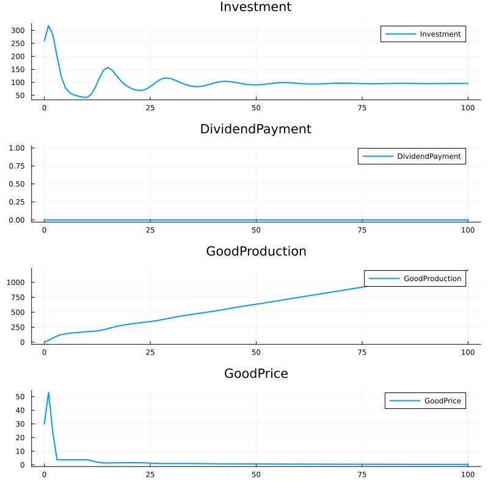
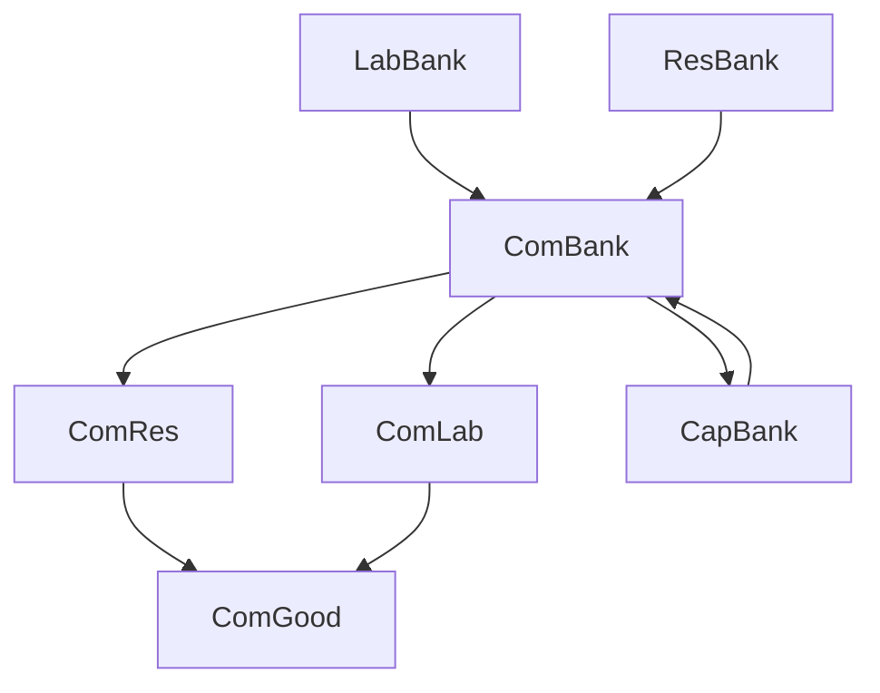

# Categorical Accounting

This section describes the categorical approach to accounting, including the mathematical foundations and practical implementations.

## Basic Transaction Structure

The basic transaction structure can be represented as:

```math
A \to B
```

where A and B are accounts.

## Basic Concepts

In categorical accounting, we represent financial transactions as morphisms between objects (accounts). A simple example:

```math
\begin{array}{ccc}
A & \to & B \\
& \to & \downarrow \\
& & C
\end{array}
```

This shows financial flows between accounts A, B, and C.

## Double Entry Bookkeeping

Double entry bookkeeping can be represented categorically as:

```math
\begin{array}{ccc}
Assets & \to & Liabilities \\
& \to & \downarrow \\
& & Equity
\end{array}
```

This maintains the fundamental accounting equation: Assets = Liabilities + Equity.

## Mathematical Formalization

The categorical approach to accounting provides a rigorous mathematical foundation:

1. **Objects (Accounts)**: Each account is an object in our category
   ```math
   A, B, C \in C
   ```

2. **Morphisms (Flows)**: Financial transactions are morphisms
   ```math
   f: A \to B
   ```

3. **Composition**: Sequential transactions compose
   ```math
   g \circ f: A \to C
   ```

4. **Invariants**: Conservation laws are expressed as transformations
   ```math
   \sum in_i = \sum out_j
   ```

## MOMASCF Structure

The MOMASCF system is represented as follows:

### Objects (Accounts)
```math
Accounts = \{
LabBank, LabLab, LabGood, 
ResBank, ResRes, ResGood,
CapBank, CapDiv, CapGood,
ComBank, ComLoan, ComDiv, ComRes, ComLab, ComGood,
BankComLoan, BankComBank, BankLabBank, BankResBank, BankCapBank
\}
```

### Morphisms (Flows)
```math
\begin{array}{rcl}
Investment & : & ComBank \to ComRes + ComLab \\
Consumption & : & Banks \to ComBank \\
Dividend & : & ComBank \to CapBank \\
Production & : & ComRes + ComLab \to ComGood
\end{array}
```

### Invariants
```math
\begin{array}{rcl}
InvCapBank & = & AccCapBank - AccBankCapBank \\
InvResBank & = & AccResBank - AccBankResBank \\
InvComBank & = & AccComBank - AccBankComBank \\
InvComLoan & = & AccBankComLoan - AccComLoan \\
InvLabBank & = & AccLabBank - AccBankLabBank
\end{array}
```

### Macro Invariant
```math
InvMacro = InvCapBank + InvResBank + InvComBank + InvComLoan + InvLabBank
```

### Production Function
The production process is:

```math
F(ComGood) = 1 + Scale \cdot (Lab)^a \cdot (Res)^{1-a}
```

### Investment Function
The investment decision process:

```math
Investment = A + \frac{B}{1 + e^{-D/C}}
```

## Simulation Results

### Key Variables Evolution


### Flow Diagram


### Conservation Laws

The system maintains several conservation laws:

1. **Bank Account Conservation**:
```math
\sum \text{Bank Accounts} = \text{Constant}
```

2. **Flow Conservation**:
```math
\text{Inflows} = \text{Outflows}
```

3. **Production-Consumption Balance**:
```math
\text{Production} = \text{Consumption} + \text{Investment}
```

## Implementation

The categorical structure is implemented in the simulation code through:

1. **Object Implementation** (State Structure):
```julia
@with_kw mutable struct State
    Parameters::NamedTuple
    AccLabBank::Float64 = 0.0
    # ... other accounts ...
end
```

2. **Morphism Implementation** (State Transition):
```julia
function StateTransition(sim, state, period)
    # Calculate invariances
    InvCapBank = state.AccCapBank - state.AccBankCapBank
    # ... other invariances ...
    
    # Calculate flows
    Investment = pars.sigA + pars.sigB / (1.0 + exp(-DemandSurplus / pars.sigC))
    # ... other flows ...
end
```

3. **Functor Implementation** (Production):
```julia
GoodProduction = 1 + pars.ScaleProd * 
                 state.AccComLab^pars.LabResSubstProd * 
                 state.AccComRes^(1 - pars.LabResSubstProd)
``` 